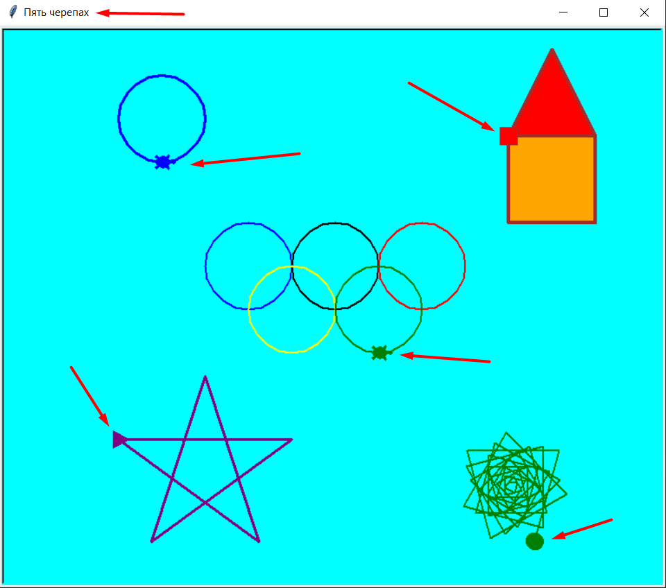

# Задача 5 черепах

    

Вам нужно создать программу с использованием модуля `turtle`, которая рисует пять различных фигур на экране. Для каждой фигуры предусмотрена отдельная черепаха с уникальными параметрами. Ниже описаны требования к каждой черепахе и фигуре:

---

#### 1. **Первая черепаха: круг**
- **Форма черепахи**: "turtle".
- **Цвет черепахи**: синий.
- **Толщина пера**: 3.
- **Начальная позиция**: (-200, 170).
- **Фигура**: круг радиусом 50.

---

#### 2. **Вторая черепаха: знак олимпиады**
- **Форма черепахи**: "turtle".
- **Цвет черепахи**: чёрный.
- **Толщина пера**: 2.
- **Начальная позиция**: (-50, 150).
- **Фигура**: знак олимпиады, состоящий из пяти перекрывающихся кругов:
  - **Цвета кругов**: синий, чёрный, красный, жёлтый, зелёный.
  - **Радиус каждого круга**: 50.
  - **Позиции центров кругов**:
    1. (-100, 0) — синий.
    2. (0, 0) — чёрный.
    3. (100, 0) — красный.
    4. (-50, -50) — жёлтый.
    5. (50, -50) — зелёный.

---

#### 3. **Третья черепаха: пентаграмма**
- **Форма черепахи**: "triangle".
- **Цвет черепахи**: фиолетовый.
- **Толщина пера**: 3.
- **Начальная позиция**: (-250, -150).
- **Фигура**: пентаграмма (пятиконечная звезда):
  - **Длина стороны**: 200.
  - **Угол поворота**: 144 градуса.

---

#### 4. **Четвёртая черепаха: цветной дом**
- **Форма черепахи**: "square".
- **Цвет черепахи**: коричневый.
- **Толщина пера**: 4.
- **Начальная позиция**: (200, 200).
- **Фигура**: простой дом, состоящий из:
  1. **Квадрат (стены)**:
     - **Размер стороны**: 100.
     - **Цвет заливки**: оранжевый.
  2. **Треугольник (крыша)**:
     - **Цвет заливки**: красный.
     - **Координаты треугольника**:
       - Левая точка: (200, 200).
       - Верхняя точка: (250, 300).
       - Правая точка: (300, 200).

---

#### 5. **Пятая черепаха: спираль**
- **Форма черепахи**: "circle".
- **Цвет черепахи**: зелёный.
- **Толщина пера**: 2.
- **Начальная позиция**: (200, -200).
- **Фигура**: спиральный узор:
  - **Начальная длина стороны**: 10.
  - **Увеличение длины каждой стороны**: на 2 пикселя.
  - **Угол поворота**: 105 градусов.
  - **Количество витков**: 50.

---

### Дополнительные требования
- Экран должен иметь:
  - **Цвет фона**: "cyan".
  - **Заголовок окна**: "Пять черепах".
- Программа должна завершаться только после закрытия окна пользователем.

---

### Примечание
Используйте методы `penup()`, `pendown()`, `goto()`, `circle()`, а также циклы для рисования повторяющихся элементов (звёзд, спиралей, кругов).