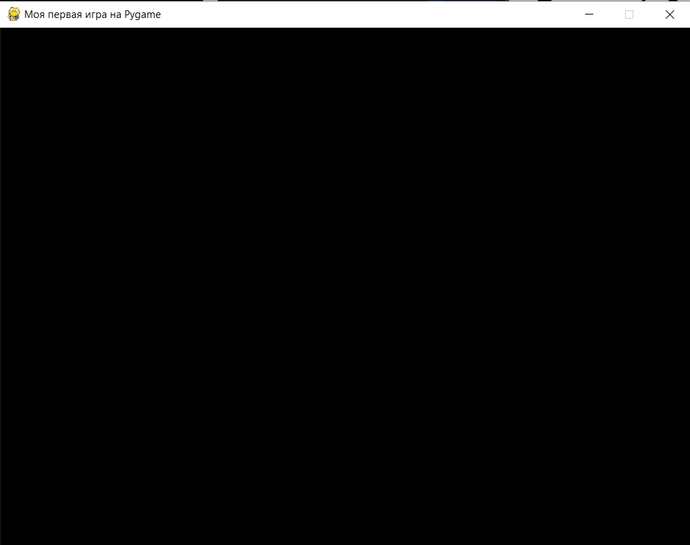

# Введение в Pygame

## Установка

Прежде чем начать, необходимо установить библиотеку Pygame. Убедитесь, что Python уже установлен на вашем компьютере.

1. Откройте терминал или командную строку.

2. Установите Pygame командой:

```bash
pip install pygame
```

3. Проверьте успешность установки, запустив следующий код в Python:

```python
import pygame
print("Pygame установлена и готова к использованию!")
```

## Создание окна

Теперь создадим простое окно с помощью Pygame.

1. Импортируем библиотеку Pygame.

2. Создадим окно с определёнными размерами.

3. Настроим заголовок окна.

Этот код создаёт окно размером `800x600` пикселей с чёрным фоном. `screen.fill`() заполняет окно указанным цветом, а `pygame.display.flip()` обновляет экран, отображая все изменения.

```python
import pygame  # Импортируем библиотеку Pygame

# Инициализируем Pygame
pygame.init()

# Задаём размеры окна
WIDTH, HEIGHT = 800, 600
screen = pygame.display.set_mode((WIDTH, HEIGHT))  # Создаём окно с размерами 800x600
pygame.display.set_caption("Простое окно")         # Устанавливаем заголовок окна

# Устанавливаем начальный цвет фона
background_color = (0, 0, 0)  # Чёрный цвет

# Рисуем начальный фон
screen.fill(background_color)  # Заполняем экран цветом
pygame.display.flip()          # Обновляем экран

# Завершаем Pygame
pygame.quit()
```

## Основной игровой цикл

В любом приложении на Pygame используется **основной игровой цикл**. 

Этот цикл позволяет обновлять окно и обрабатывать действия пользователя, такие как нажатие клавиш или закрытие окна.

**Игровой цикл состоит из следующих этапов**:

1. Проверка событий (например, нажатие клавиши или закрытие окна).

2. Обновление элементов (например, изменение цвета фона).

3. Обновление экрана.

Здесь цикл `while` запускается, пока переменная `running` равна `True`. Если пользователь закрывает окно, `running` меняется на `False`, и программа завершается.

```python
import pygame

pygame.init()

# Задаём размеры окна
WIDTH, HEIGHT = 800, 600
screen = pygame.display.set_mode((WIDTH, HEIGHT))
pygame.display.set_caption("Простое окно")

# Начальный цвет фона
background_color = (0, 0, 0)

# Запускаем основной игровой цикл
running = True
while running:
    for event in pygame.event.get():
        if event.type == pygame.QUIT:  # Проверка на закрытие окна
            running = False

    # Заполняем экран текущим цветом
    screen.fill(background_color)
    pygame.display.flip()  # Обновляем экран

pygame.quit()
```

## Изменение цвета фона при нажатии клавиш

Теперь добавим возможность изменять цвет фона, используя клавиши на клавиатуре.

Мы будем использовать события клавиатуры, чтобы менять цвет фона на один из трёх предопределённых цветов: красный, зелёный и синий.

<div>
    
</div>

- `pygame.KEYDOWN`: Событие, происходящее при нажатии клавиши.

- `event.key`: Определяет, какая клавиша была нажата.

- `pygame.K_r`: Клавиша "`r`" для установки красного фона.

- `pygame.K_g`: Клавиша "`g`" для установки зелёного фона.

- `pygame.K_b`: Клавиша "`b`" для установки синего фона.

- `pygame.K_SPACE`: Клавиша "`пробел`" для установки случайного цвета фона.

- `screen.fill(background_color)`: Заполняет экран текущим цветом.

```python
import pygame
import random  # Импортируем модуль для генерации случайных чисел

pygame.init()

# Задаём размеры окна
WIDTH, HEIGHT = 800, 600
screen = pygame.display.set_mode((WIDTH, HEIGHT))
pygame.display.set_caption("Простое окно")

# Начальный цвет фона
background_color = (0, 0, 0)

# Основной игровой цикл
running = True
while running:
    for event in pygame.event.get():
        if event.type == pygame.QUIT:
            running = False

        # Проверка нажатия клавиш
        if event.type == pygame.KEYDOWN:  # Если клавиша была нажата
            if event.key == pygame.K_r:   # Клавиша "r" для красного цвета
                background_color = (255, 0, 0)
            elif event.key == pygame.K_g: # Клавиша "g" для зелёного цвета
                background_color = (0, 255, 0)
            elif event.key == pygame.K_b: # Клавиша "b" для синего цвета
                background_color = (0, 0, 255)
            elif event.key == pygame.K_SPACE: # Клавиша "пробел" для случайного цвета
                background_color = (random.randint(0, 255), random.randint(0, 255), random.randint(0, 255))

    # Заполняем экран текущим цветом фона
    screen.fill(background_color)
    pygame.display.flip()  # Обновляем экран

pygame.quit()
```
