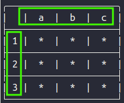
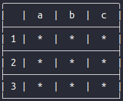
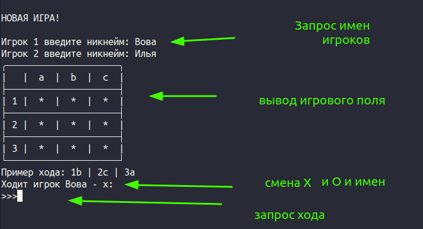
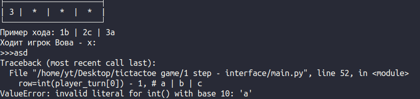
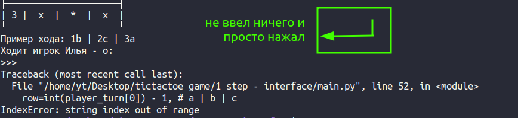
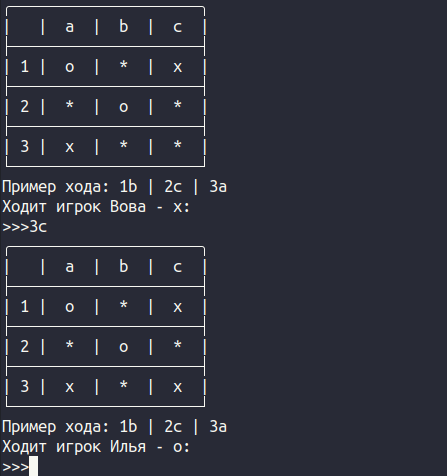

# 2 Шаг. Интерфейс

Поработаем над интерфейсом игры, пока без функционала. Начнем с **field_module.py**

У нас есть переменная с игровым полем и 3 пустые функции. Для начала давате сделаем функцию возврата текущего значения поля:

```python
# Возвращает текущее игровое поле field
def get_field():
    global field
    return field
```

Мы говорим функции, что переменная `field` является глобальной и объявлена где-то вне функции. И затем возвращаем ее текущее значение. Убедиться в работоспособности функции можно, если в этом же модуле ниже вызвать ее и вывести результат на экран. Рекомендую проверять каждую функцию таким образом сразу после ее написания.

```python
current_field_state = get_field()
print(current_field_state)
```

После того, как убедились, что функция работает корректно, не забываем удалять проверочный код.

Следующая функция выводит игровое поле в красивом виде с маркерами 1-2-3 и A-B-C для ввода хода

<p style="display: flex; gap: 5px">
    
    
</p>

```python
# Выводит в терминал оформленное игровое поле
def show_field():
    global field

    i = 1
    print(TOP_FIELD_LINE) # TOP_FIELD_LINE --> ╭─────────────────────╮
    print(TOP_FIELD_CELLS) # TOP_FIELD_CELLS --> |   |  a  |  b  |  c  |

    for line in field:
        print(MID_FIELD_LINE) # MID_FIELD_LINE --> ├─────────────────────┤
        print('|', i, end=" |  ")
        
        for cell in line:
            print(cell, ' | ', end=' ')

        i += 1
        print()

    print(BOTTOM_FIELD_LINE) # BOTTOM_FIELD_LINE --> └─────────────────────┘
```

Если попробовать запустить ее, то python выведет исключительную ситуацию и напишет, что не может найти константы `TOP_FIELD_LINE`, `TOP_FIELD_CELLS`, `MID_FIELD_LINE` и `BOTTOM_FIELD_LINE`. Давайте его опередим и подключим их из модуля **constants.py.** На первой строке модуля добавляем `import` 

```python
from constants import (
    EMPTY_CELL,
    TOP_FIELD_CELLS,
    TOP_FIELD_LINE,
    MID_FIELD_LINE,
    BOTTOM_FIELD_LINE,
)
```

Теперь функцию можно тестировать, вызвав ее по имени `show_field()`.

Последняя функция в этом модуле будет устанавливать крестик или нолик в игровое поле. И для ее корректной работы она должна принимать номер строки (`row`), номер столбца (`col`) и само значение хода игрока — **Х** или **О** (`player`).

```python
def set_cell_in_field(row: int, col: int, player: str):
    """
        функция устанавливает player в поле
        row - номер строки
        col - номер столбца
        player - значение игрока - Х или О
    """

    global field
    
    if field[row][col] == EMPTY_CELL:
        field[row][col] = player
        return True
    else: 
        return False
```

Теперь давайте переместимся в модуль **main.py**

```python
from constants import TURN_TEXT, LETTER_TO_INDEX, NICKNAME_INPUT
from field_module import (
    set_cell_in_field,
    show_field,
)

# Меняет переменную с текущим игроком O --> X или наоборот
def change_player():
    global player_name, player_value

    # Проверка имени текущего игрока
    if player_name == nikname_1:
        player_name = nikname_2
        player_value = 'o'

    elif player_name == nikname_2:
        player_name = nikname_1
        player_value = 'x'

# START GAME

# Выводим доску лидеров

print('\n' + 'НОВАЯ ИГРА!' + '\n')

# Запрашиваем НИК для х
nikname_1 = input(NICKNAME_INPUT.format(1)).capitalize()
# Запрашиваем НИК для о
nikname_2 = input(NICKNAME_INPUT.format(2)).capitalize()

# Переменная для текущего игрока. Чередуется после каждого хода
player_name = nikname_1
# Переменная для Х или О для текущего игрока
player_value = 'x'

while True:
    # Выводится поле
    show_field()
    
    # Запрос хода (х | о)
    player_turn = input(TURN_TEXT.format(player_name, player_value)).lower()

    # Проверяем 1-ый и 2-ой символы на правильность

    # Проверяем пустая ли клетка, куда игрок хочет походить

    # Ход игрока
    set_cell_in_field(
        row=int(player_turn[0]) - 1, # a | b | c
        col=LETTER_TO_INDEX[player_turn[1]], # 1 | 2 | 3
        player=player_value # x | o
    )

    # Проверка выйгрыша

    # Если кто-то выиграл, то выводим победителя и завершаем игру

    # Смена игрока
    change_player()

# Определяем победителя
    # сохраняем результаты

```

После запуска игры появляются 3 возможные ситуцаии:

<p style="display: flex; gap: 5px;">
    1. 
</p>

2) Исключение в случае ввода некорректного хода

<p style="display: flex; gap: 5px;">
    2.1 
</p>

<p style="display: flex; gap: 5px;">
    2.2 
</p>

3) Х или О ставится в поле и каждый ход меняется имя игрока и соответсвующие начение (Х-О)

<p style="display: flex; gap: 5px;">
    
</p>
