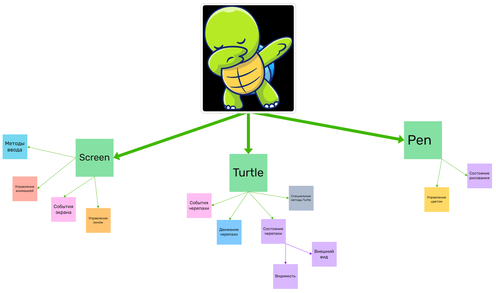

# Методы и функции в `turtle`

Модуль `turtle` предоставляет удобный интерфейс для графического рисования, где вы можете управлять "черепахой" (курсор в форме черепашки) для рисования линий, фигур и создания анимации. На схеме выделены ключевые компоненты: `Screen`, `Turtle`, и `Pen`. 

<div>
    
</div>

Рассмотрим каждый из них более подробно, включая их методы и возможные применения.

## 1. Screen (Экран)

### Основные методы `Screen`

##### Методы ввода

`onscreenclick()`: Обрабатывает щелчки мыши на экране.

`textinput()`: Открывает окно для ввода текста.

`numinput()`: Открывает окно для ввода числовых значений.

```python
import turtle

def on_click(x, y):
    print("Clicked at", x, y)

screen = turtle.Screen()
screen.onscreenclick(on_click)  # Обработка щелчков мыши
screen.mainloop()
```

##### Управление анимацией

`tracer()`: Контролирует скорость анимации.

`update()`: Обновляет экран, если анимация отключена.

```python
screen.tracer(0)  # Отключаем анимацию
```

##### События экрана

`listen()`: Переводит фокус на экран для обработки событий с клавиатуры.

`onkey()`, `onkeypress()`, `onkeyrelease()`: Привязывают функции к определённым клавишам.

```python
def function():
    print("Key pressed!")

screen.listen()
screen.onkey(function, "space")
```

##### Управление окном

`bgcolor()`: Устанавливает цвет фона экрана.

```python
screen.bgcolor("lightblue")
```

`title()`: Устанавливает заголовок окна.

```python
screen.title("Моя графика")
```

## 2. Turtle (Черепаха)

`Turtle` — основной объект, представляющий "черепаху", который управляет её движением, состоянием и внешним видом.

##### События черепахи

`onclick()`: Определяет действие при щелчке на черепахе.

```python
def on_turtle_click(x, y):
    print("Черепаха была кликнута!")

t = turtle.Turtle()
t.onclick(on_turtle_click)
```

##### Движение черепахи

`forward()`, `backward()`: Движение вперёд и назад.

```python
t.forward(100)   # Движение на 100 пикселей вперёд
t.backward(50)   # Движение на 50 пикселей назад
```

`right()`, `left()`: Поворот вправо и влево.

```python
t.right(90)      # Поворот на 90 градусов вправо
t.left(45)       # Поворот на 45 градусов влево
```

`goto()`: Перемещение черепахи в заданную точку.

```python
t.goto(50, 50)   # Переместиться в координаты (50, 50)
```

`setheading()`: Устанавливает направление черепахи.

```python
t.setheading(90)  # Устанавливает черепаху на север
```

##### Состояние черепахи

`penup()`, `pendown()`: Поднимает и опускает черепаху, чтобы она перестала или начала рисовать.

```python
t.penup()       # Перестаёт рисовать
t.goto(100, 100)
t.pendown()     # Начинает рисовать
```

`speed()`: Устанавливает скорость черепахи.

```python
t.speed(1)      # Очень медленно
t.speed(10)     # Очень быстро
```

##### Внешний вид

`shape()`: Устанавливает форму черепахи.

```python
t.shape("turtle")  # Задает форму черепахи в виде черепашки
```

`shapesize()`: Меняет размер черепахи.

```python
t.shapesize(2, 2)  # Увеличение размера черепахи
```

`color()`: Задаёт цвет черепахи и линии.

```python
t.color("red", "yellow")  # Цвет линии и заполнения
```

## 3. Pen (Перо)

`Pen` в `turtle` управляет состоянием рисования и внешним видом линий.

##### Состояние рисования

`begin_fill()` и `end_fill()`: Начинает и завершает заливку.

```python
t.color("blue")
t.begin_fill()
for _ in range(4):
    t.forward(100)
    t.right(90)
t.end_fill()
```

##### Управление цветом

`pencolor()`: Устанавливает цвет линии.

```python
t.pencolor("green")
t.forward(50)
```

`fillcolor()`: Устанавливает цвет заливки.

```python
t.fillcolor("blue")
```

`pensize()`: Меняет толщину линии.

```python
t.pensize(5)   # Устанавливает толщину линии на 5 пикселей
```

##### Другие методы Pen

`reset()`: Очищает экран и возвращает черепаху к исходному положению.

```python
t.reset()
```

`clear()`: Очищает линии на экране, но оставляет черепаху в текущей позиции.

```python
t.clear()
```


