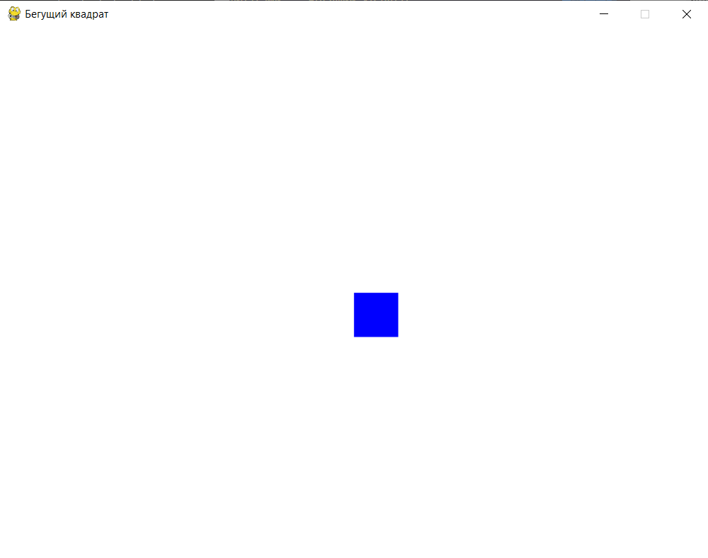
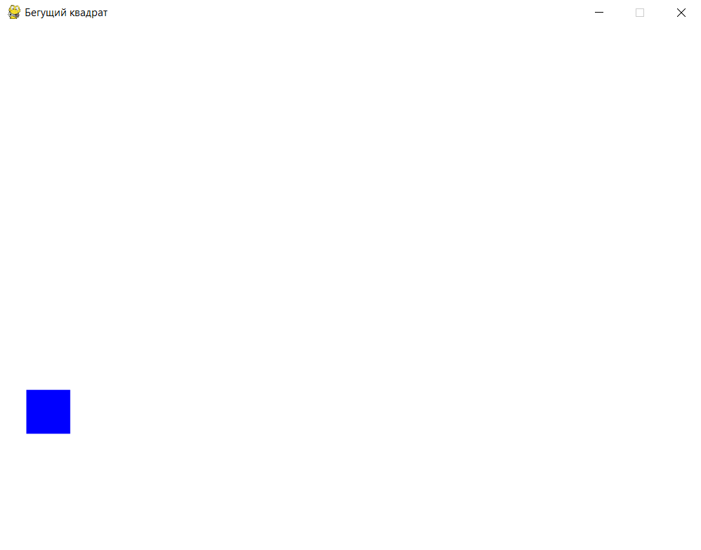
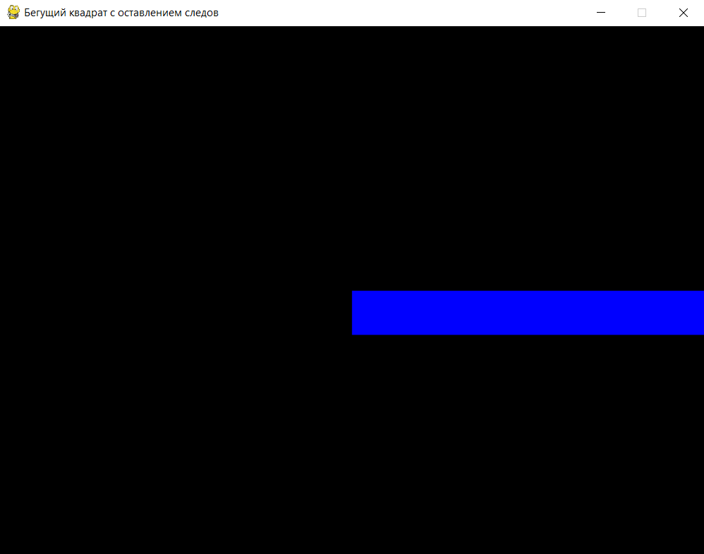
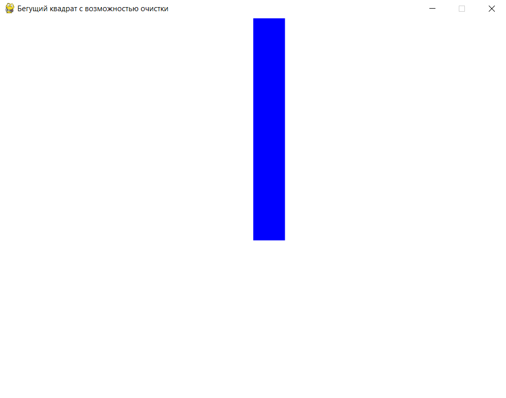
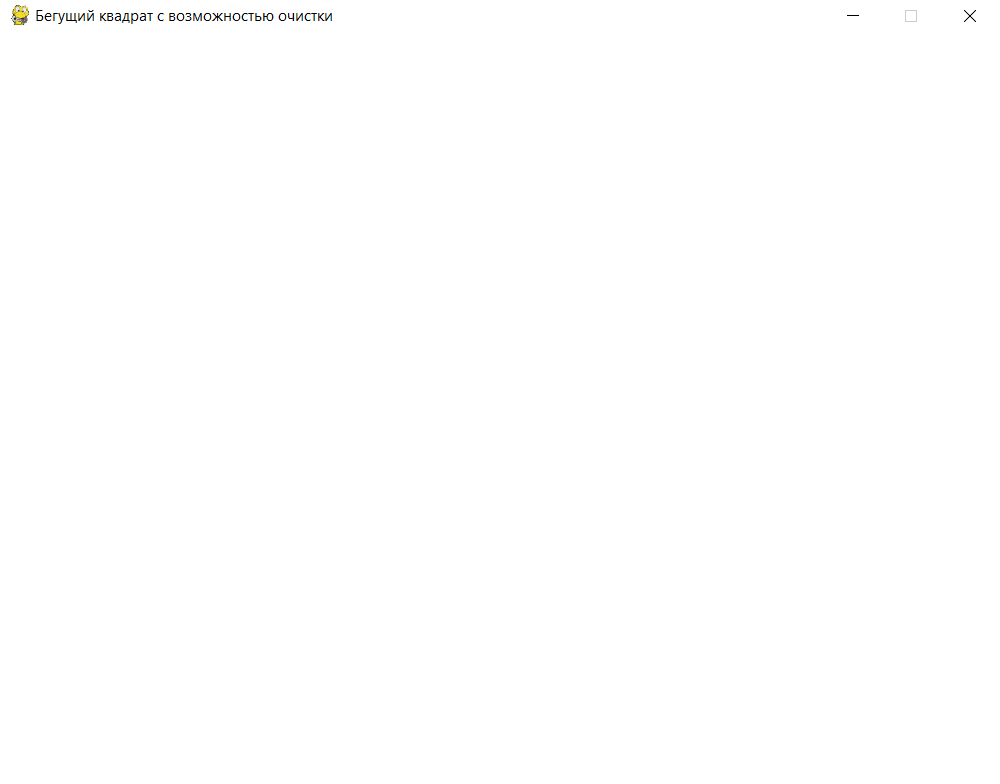

# Работа с объектами и координатами — "Бегущий квадрат"

## Использование объектов и координат с Rect

В Pygame для работы с координатами и объектами на экране часто используется `Rect`. Это объект, представляющий прямоугольник, который можно легко перемещать и изменять. `Rect` помогает отслеживать положение объектов и управлять их движением.

#### Создание объекта с использованием Rect

Давайте создадим простое окно с квадратом, расположенным в центре экрана.

1. **Создание Rect**: `square = pygame.Rect(x, y, size, size)` — создаёт прямоугольник (квадрат), задавая его координаты и размеры.

2. **Рисование квадрата**: `pygame.draw.rect(screen, square_color, square)` — рисует прямоугольник `square` с цветом `square_color` на экране `screen`.

3. **Обновление экрана**: `screen.fill(background_color)` и `pygame.display.flip()` очищают и обновляют экран.

<div>
    
</div>

```python
import pygame  # Импортируем библиотеку Pygame

# Инициализация Pygame
pygame.init()

# Задаём размеры окна
WIDTH, HEIGHT = 800, 600
screen = pygame.display.set_mode((WIDTH, HEIGHT))  # Создаём окно с заданными размерами
pygame.display.set_caption("Бегущий квадрат")      # Устанавливаем заголовок окна

# Задаём параметры квадрата
size = 50  # Размер стороны квадрата
x, y = WIDTH // 2, HEIGHT // 2  # Начальные координаты квадрата в центре экрана

# Создаём объект Rect для квадрата
square = pygame.Rect(x, y, size, size)  # (x, y) — координаты квадрата, (size, size) — размеры

# Основной цвет фона и квадрата
background_color = (255, 255, 255)  # Белый цвет для фона
square_color = (0, 0, 255)          # Синий цвет для квадрата

# Основной игровой цикл
running = True
while running:
    for event in pygame.event.get():  # Обрабатываем события
        if event.type == pygame.QUIT:  # Проверка на закрытие окна
            running = False

    screen.fill(background_color)  # Очищаем экран, заливая его белым цветом
    pygame.draw.rect(screen, square_color, square)  # Рисуем квадрат на экране
    pygame.display.flip()  # Обновляем экран

# Завершаем работу Pygame
pygame.quit()
```

## Перемещение объекта

Теперь добавим управление квадратом с помощью клавиш. Когда игрок нажимает на клавиши-стрелки, квадрат будет двигаться.

**Перемещение квадрата:**

- `keys = pygame.key.get_pressed()` возвращает словарь со всеми клавишами. `keys[pygame.K_LEFT]` проверяет, нажата ли конкретная клавиша.

- Если нажата клавиша "влево", `square.x -= speed` уменьшает координату `x` квадрата, сдвигая его влево. Аналогично работают остальные направления.

**Обновление экрана:** каждый раз очищаем экран `screen.fill(background_color)`, а затем рисуем квадрат.

<div>
    
</div>

```python
import pygame

pygame.init()

# Задаём размеры окна
WIDTH, HEIGHT = 800, 600
screen = pygame.display.set_mode((WIDTH, HEIGHT))
pygame.display.set_caption("Бегущий квадрат")

# Параметры квадрата
size = 50  # Размер стороны квадрата
x, y = WIDTH // 2, HEIGHT // 2  # Начальные координаты квадрата
square = pygame.Rect(x, y, size, size)  # Создаём квадрат с помощью Rect

# Цвета
background_color = (255, 255, 255)  # Белый фон
square_color = (0, 0, 255)          # Синий квадрат

# Скорость движения квадрата
speed = 5

running = True
while running:
    for event in pygame.event.get():  # Обрабатываем события
        if event.type == pygame.QUIT:
            running = False

    # Получаем состояние всех клавиш
    keys = pygame.key.get_pressed()

    # Перемещение квадрата
    if keys[pygame.K_LEFT]:   # Если нажата клавиша "влево"
        square.x -= speed
    if keys[pygame.K_RIGHT]:  # Если нажата клавиша "вправо"
        square.x += speed
    if keys[pygame.K_UP]:     # Если нажата клавиша "вверх"
        square.y -= speed
    if keys[pygame.K_DOWN]:   # Если нажата клавиша "вниз"
        square.y += speed

    screen.fill(background_color)  # Очищаем экран
    pygame.draw.rect(screen, square_color, square)  # Рисуем квадрат
    pygame.display.flip()  # Обновляем экран

pygame.quit()
```

## Оставление следов при перемещении

Теперь добавим возможность оставлять следы. Для этого мы уберём очистку экрана и будем перерисовывать квадрат в новом положении.

1. **Убираем очистку экрана**: убрав `screen.fill(background_color)`, мы оставляем след от квадрата, потому что каждый новый квадрат рисуется поверх предыдущего.

2. **Перемещение**: остаётся таким же, как и в предыдущем примере.

<div>
    
</div>

```python
import pygame

pygame.init()

# Задаём размеры окна
WIDTH, HEIGHT = 800, 600
screen = pygame.display.set_mode((WIDTH, HEIGHT))
pygame.display.set_caption("Бегущий квадрат с оставлением следов")

# Параметры квадрата
size = 50
x, y = WIDTH // 2, HEIGHT // 2
square = pygame.Rect(x, y, size, size)

# Цвет квадрата
square_color = (0, 0, 255)

# Скорость движения квадрата
speed = 5

running = True
while running:
    for event in pygame.event.get():
        if event.type == pygame.QUIT:
            running = False

    keys = pygame.key.get_pressed()

    # Перемещение квадрата
    if keys[pygame.K_LEFT]:
        square.x -= speed
    if keys[pygame.K_RIGHT]:
        square.x += speed
    if keys[pygame.K_UP]:
        square.y -= speed
    if keys[pygame.K_DOWN]:
        square.y += speed

    # Рисуем квадрат без очистки экрана, оставляя след
    pygame.draw.rect(screen, square_color, square)
    pygame.display.flip()  # Обновляем экран

pygame.quit()
```

## Мини-игра "Бегущий квадрат"

Теперь давайте объединим всё вместе и добавим возможность очистки экрана, чтобы игрок мог стирать следы квадрата.

<div style="display: flex">
    
    
</div>
