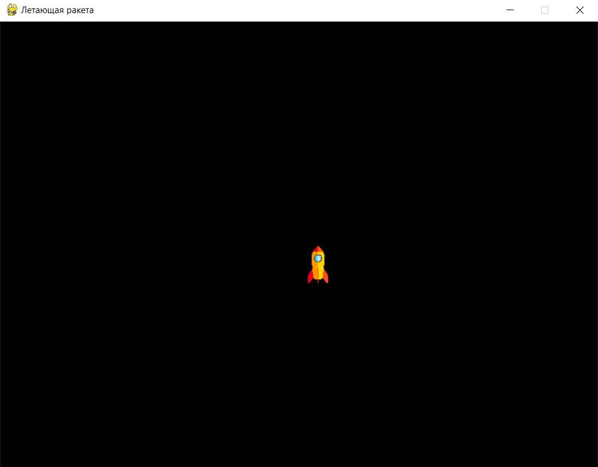
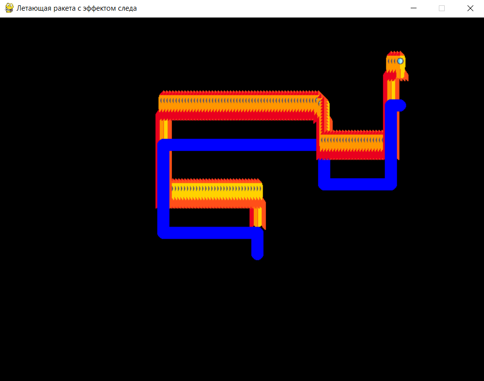

# Работа с изображениями и спрайтами

## Загрузка и отображение изображения ракеты

Для начала загрузим изображение ракеты и отобразим его на экране. 

#### Шаг 1: Подготовка изображения

Сначала найдите и сохраните изображение ракеты (в формате `.png` или `.jpg`) в папку с вашим проектом. Или [скачайте по ссылке](https://disk.yandex.kz/i/RfBTjDfS_qXfSA). Назовите его, например, `rocket.png`.

#### Шаг 2: Загрузка изображения в Pygame

Используем функцию `pygame.image.load()` для загрузки изображения и отобразим его на экране.

1. **Загрузка изображения**: pygame.image.load("rocket.png") загружает изображение ракеты из файла.

2. **Масштабирование изображения**: `pygame.transform.scale(rocket_image, (50, 50))` изменяет размеры изображения на `50x50` пикселей.

3. **Рисование изображения**: `screen.blit(rocket_image, (x, y))` отображает изображение на экране по координатам `(x, y)`.

4. **Обновление экрана**: `screen.fill((0, 0, 0))` заливает экран чёрным цветом, чтобы создать фон космоса.

<div>
    
</div>

```python
import pygame  # Импортируем библиотеку Pygame

# Инициализируем Pygame
pygame.init()

# Задаём размеры окна
WIDTH, HEIGHT = 800, 600
screen = pygame.display.set_mode((WIDTH, HEIGHT))  # Создаём окно
pygame.display.set_caption("Летающая ракета")      # Устанавливаем заголовок окна

# Загрузка изображения ракеты
rocket_image = pygame.image.load("rocket.png")  # Загружаем изображение ракеты
rocket_image = pygame.transform.scale(rocket_image, (50, 50))  # Масштабируем изображение до нужного размера

# Начальные координаты ракеты
x, y = WIDTH // 2, HEIGHT // 2  # Начальное положение ракеты — центр экрана

# Основной игровой цикл
running = True
while running:
    for event in pygame.event.get():  # Обрабатываем события
        if event.type == pygame.QUIT:
            running = False

    screen.fill((0, 0, 0))  # Заливаем экран чёрным цветом (фон — космос)
    
    # Отображаем ракету на экране
    screen.blit(rocket_image, (x, y))  # Рисуем ракету по координатам (x, y)
    
    pygame.display.flip()  # Обновляем экран

# Завершаем работу Pygame
pygame.quit()
```

## Перемещение ракеты по экрану

Теперь добавим управление ракетой с помощью клавиш. Когда игрок нажимает на стрелки, ракета будет двигаться по экрану.


1. **Получение состояния клавиш**: `keys = pygame.key.get_pressed()` возвращает словарь со всеми клавишами.

2. **Перемещение ракеты**:

    - Если нажата клавиша "влево", `x -= speed` уменьшает координату `x`, перемещая ракету влево.

    - Аналогично работают остальные направления.

3. **Отображение новой позиции**: `screen.blit(rocket_image, (x, y))` рисует ракету в новом положении.

<div>
    
</div>

```python
import pygame

pygame.init()

WIDTH, HEIGHT = 800, 600
screen = pygame.display.set_mode((WIDTH, HEIGHT))
pygame.display.set_caption("Летающая ракета")

rocket_image = pygame.image.load("rocket.png")
rocket_image = pygame.transform.scale(rocket_image, (50, 50))

x, y = WIDTH // 2, HEIGHT // 2  # Начальная позиция ракеты
speed = 5  # Скорость движения ракеты

running = True
while running:
    for event in pygame.event.get():
        if event.type == pygame.QUIT:
            running = False

    # Получаем состояние всех клавиш
    keys = pygame.key.get_pressed()

    # Управление ракетой
    if keys[pygame.K_LEFT]:   # Если нажата клавиша "влево"
        x -= speed
    if keys[pygame.K_RIGHT]:  # Если нажата клавиша "вправо"
        x += speed
    if keys[pygame.K_UP]:     # Если нажата клавиша "вверх"
        y -= speed
    if keys[pygame.K_DOWN]:   # Если нажата клавиша "вниз"
        y += speed

    screen.fill((0, 0, 0))  # Заливаем экран чёрным цветом
    screen.blit(rocket_image, (x, y))  # Рисуем ракету в новой позиции
    pygame.display.flip()  # Обновляем экран

pygame.quit()
```

## Создание эффекта "следа" для анимации полёта

Теперь добавим эффект "следа", который будет оставлять ракета при движении, чтобы создать ощущение полёта в космосе.

1. **Создание следа**: `pygame.draw.circle(screen, trail_color, (x + 25, y + 90), 10)` рисует синий круг позади ракеты, создавая иллюзию "следа". Координаты `(x + 25, y + 90)` задают позицию круга так, чтобы он находился за ракетой.

2. **Постепенное накопление следа**: Поскольку мы не очищаем экран каждый раз, следы остаются, пока ракета движется.

<div>
    
</div>

```python
import pygame

pygame.init()

WIDTH, HEIGHT = 800, 600
screen = pygame.display.set_mode((WIDTH, HEIGHT))
pygame.display.set_caption("Летающая ракета с эффектом следа")
FPS = pygame.time.Clock()

rocket_image = pygame.image.load("rocket.png")
rocket_image = pygame.transform.scale(rocket_image, (50, 50))

x, y = WIDTH // 2, HEIGHT // 2  # Начальная позиция ракеты
speed = 5  # Скорость движения ракеты

# Основной цвет следа
trail_color = (0, 0, 255)  # Синий цвет следа

running = True
while running:
    for event in pygame.event.get():
        if event.type == pygame.QUIT:
            running = False

    keys = pygame.key.get_pressed()

    # Перемещение ракеты
    if keys[pygame.K_LEFT]:
        x -= speed
    if keys[pygame.K_RIGHT]:
        x += speed
    if keys[pygame.K_UP]:
        y -= speed
    if keys[pygame.K_DOWN]:
        y += speed

    # Рисуем след за ракетой
    pygame.draw.circle(screen, trail_color, (x + 25, y + 90), 10)  # Создаём маленький круг позади ракеты

    # Отображаем ракету
    screen.blit(rocket_image, (x, y))
    pygame.display.update()  # Обновляем экран
    FPS.tick(60)

pygame.quit()
```
