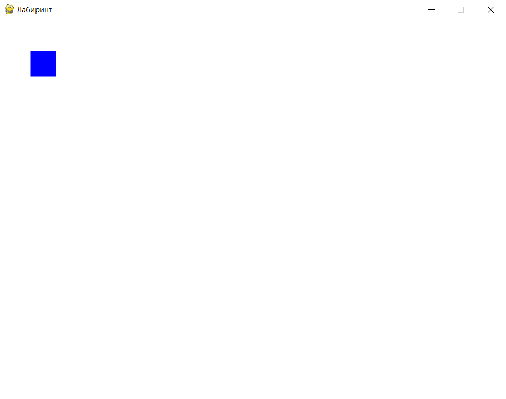
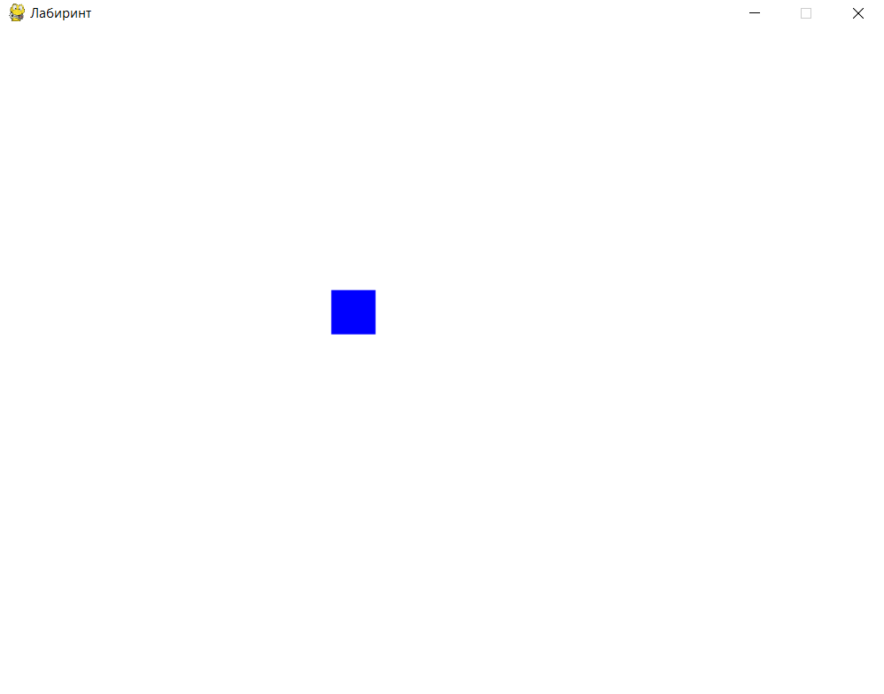
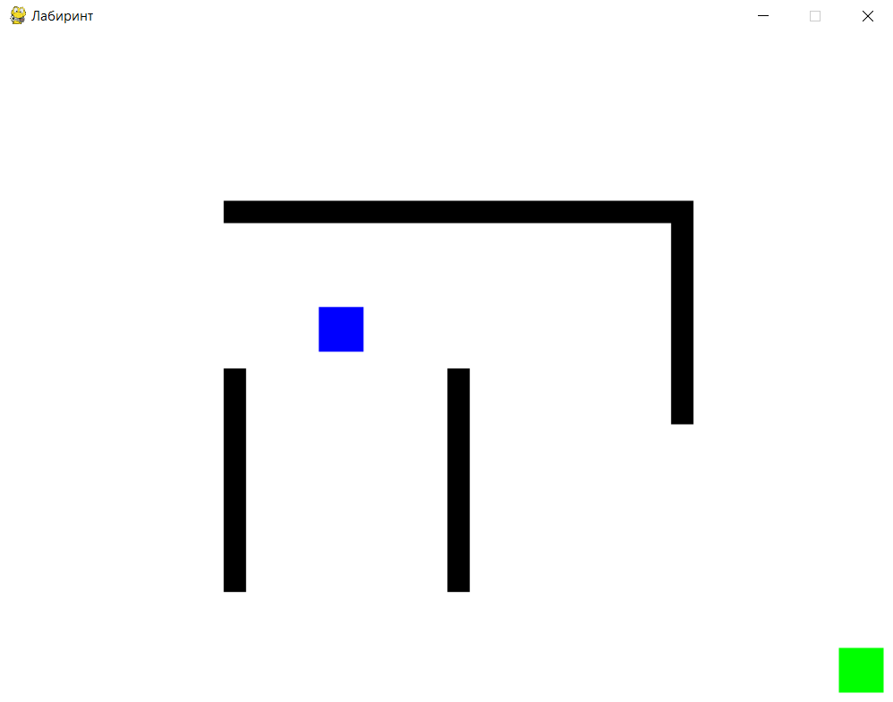

# Обработка событий клавиатуры — "Лабиринт"

## Основы обработки событий клавиатуры

В Pygame обработка клавиш осуществляется с помощью системы событий. Мы можем отслеживать, какие клавиши нажаты или отпущены, и использовать это для управления персонажем.

## Создание окна и отображение персонажа

Сначала создадим окно и отобразим нашего персонажа. Используем простую фигуру (квадрат) для представления игрока.

<div>
    
</div>

1. **Создание окна**: pygame.display.set_mode((WIDTH, HEIGHT)) — создаёт окно размером 800x600 пикселей.

2. **Отображение игрока**: pygame.draw.rect(screen, player_color, (player_x, player_y, player_size, player_size)) рисует квадрат игрока на экране.

**Базовый шаблон для мини-игры**

```python
import pygame  # Импортируем библиотеку Pygame

# Инициализация Pygame
pygame.init()

# Задаём размеры окна
WIDTH, HEIGHT = 800, 600
screen = pygame.display.set_mode((WIDTH, HEIGHT))  # Создаём окно с заданными размерами
pygame.display.set_caption("Лабиринт")             # Устанавливаем заголовок окна
FPS = pygame.time.Clock()

# Цвета
background_color = (255, 255, 255)  # Белый фон
player_color = (0, 0, 255)          # Синий цвет для игрока
wall_color = (0, 0, 0)              # Чёрный цвет для стен

# Параметры игрока
player_size = 40
player_x, player_y = 50, 50  # Начальные координаты игрока
player_speed = 5             # Скорость движения игрока

running = True
while running:
    for event in pygame.event.get():  # Обрабатываем события
        if event.type == pygame.QUIT:  # Проверка на закрытие окна
            running = False

    # Заливаем экран белым цветом
    screen.fill(background_color)

    # Рисуем игрока на экране
    pygame.draw.rect(screen, player_color, (player_x, player_y, player_size, player_size))

    pygame.display.flip()  # Обновляем экран
    FPS.tick(60)

pygame.quit()
```

## Управление персонажем с помощью клавиш

Теперь добавим управление персонажем с помощью клавиш-стрелок. Когда игрок нажимает стрелки, квадрат будет перемещаться по экрану.

<div>
    
</div>

1. **Получение состояния клавиш**: `keys = pygame.key.get_pressed()` возвращает состояние всех клавиш.

2. **Перемещение игрока**:

    - Если нажата клавиша "влево" (`pygame.K_LEFT`), уменьшаем координату x, сдвигая игрока влево.

    - Аналогично работают клавиши "вправо", "вверх" и "вниз".

```python
import pygame

pygame.init()

WIDTH, HEIGHT = 800, 600
screen = pygame.display.set_mode((WIDTH, HEIGHT))
pygame.display.set_caption("Лабиринт")
FPS = pygame.time.Clock()

background_color = (255, 255, 255)
player_color = (0, 0, 255)

player_size = 40
player_x, player_y = 50, 50
player_speed = 5

running = True
while running:
    for event in pygame.event.get():
        if event.type == pygame.QUIT:
            running = False

    keys = pygame.key.get_pressed()  # Получаем состояние всех клавиш

    # Управление игроком
    if keys[pygame.K_LEFT]:  # Если нажата клавиша "влево"
        player_x -= player_speed
    if keys[pygame.K_RIGHT]:  # Если нажата клавиша "вправо"
        player_x += player_speed
    if keys[pygame.K_UP]:  # Если нажата клавиша "вверх"
        player_y -= player_speed
    if keys[pygame.K_DOWN]:  # Если нажата клавиша "вниз"
        player_y += player_speed

    screen.fill(background_color)
    pygame.draw.rect(screen, player_color, (player_x, player_y, player_size, player_size))
    pygame.display.flip()
    FPS.tick(60)

pygame.quit()
```

## Создание лабиринта с препятствиями

Теперь создадим стены лабиринта, чтобы игроку нужно было избегать их и находить путь к финишу. Мы добавим прямоугольные области (стены), которые будут выступать в роли препятствий.

<div>
    
</div>

1. **Создание стен**: `walls` — это список объектов `pygame.Rect`, которые представляют стены.

2. **Проверка столкновений**:

    - `player_rect = pygame.Rect(player_x, player_y, player_size, player_size)` создаёт прямоугольник игрока.

    - `player_rect.colliderect(wall)` проверяет, пересекается ли игрок с какой-либо стеной.

    - Если пересечение обнаружено, возвращаем игрока на предыдущую позицию.

3. **Финиш**:

    - Финишная точка создаётся как `finish = pygame.Rect(750, 550, 40, 40)`.

    - Если игрок достигает финиша, игра завершается, выводя сообщение.

```python
import pygame

pygame.init()

WIDTH, HEIGHT = 800, 600
screen = pygame.display.set_mode((WIDTH, HEIGHT))
pygame.display.set_caption("Лабиринт")
FPS = pygame.time.Clock()

background_color = (255, 255, 255)
player_color = (0, 0, 255)
wall_color = (0, 0, 0)
finish_color = (0, 255, 0)

player_size = 40
player_x, player_y = 50, 50
player_speed = 5

# Создаём стены лабиринта
walls = [
    pygame.Rect(200, 150, 400, 20),
    pygame.Rect(200, 300, 20, 200),
    pygame.Rect(400, 300, 20, 200),
    pygame.Rect(600, 150, 20, 200)
]

# Определяем конечную точку (финиш)
finish = pygame.Rect(750, 550, 40, 40)  # Финишная точка в нижнем правом углу

running = True
while running:
    for event in pygame.event.get():
        if event.type == pygame.QUIT:
            running = False

    keys = pygame.key.get_pressed()

    # Сохраняем предыдущие координаты
    previous_x, previous_y = player_x, player_y

    # Управление игроком
    if keys[pygame.K_LEFT]:
        player_x -= player_speed
    if keys[pygame.K_RIGHT]:
        player_x += player_speed
    if keys[pygame.K_UP]:
        player_y -= player_speed
    if keys[pygame.K_DOWN]:
        player_y += player_speed

    # Проверка на столкновение с каждой стеной
    player_rect = pygame.Rect(player_x, player_y, player_size, player_size)
    for wall in walls:
        if player_rect.colliderect(wall):  # Если игрок сталкивается со стеной
            player_x, player_y = previous_x, previous_y  # Возвращаем игрока на предыдущую позицию

    # Проверка на достижение финиша
    if player_rect.colliderect(finish):
        print("Поздравляем! Вы дошли до финиша!")
        running = False

    screen.fill(background_color)  # Очищаем экран

    # Рисуем стены лабиринта
    for wall in walls:
        pygame.draw.rect(screen, wall_color, wall)

    # Рисуем финишную точку
    pygame.draw.rect(screen, finish_color, finish)

    # Рисуем игрока
    pygame.draw.rect(screen, player_color, player_rect)

    pygame.display.flip()  # Обновляем экран
    FPS.tick(60)

pygame.quit()
```
