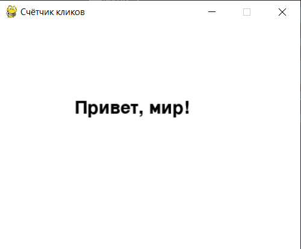
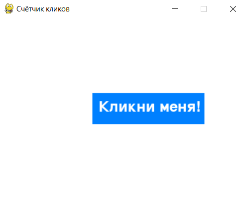

# Работа с текстом и интерфейсом

## Отображение текста на экране

Pygame позволяет добавлять текст на экран с помощью объектов шрифта. Мы будем использовать это для создания надписей, таких как заголовок, счётчик кликов и таймер.

<div>
    
</div>

- **Шрифт**: `pygame.font.Font(None, 36)` — создаёт объект шрифта, который будет использоваться для отображения текста. Размер шрифта — 36.

- **Создание текста**: `font.render("Привет, мир!", True, (0, 0, 0))` — создаёт изображение текста `"Привет, мир!"` чёрного цвета.

- **Отображение текста**: `screen.blit(text, (100, 100))` — отображает текст на экране в заданных координатах.

```python
import pygame

# Инициализация Pygame
pygame.init()

# Задаём размеры окна
WIDTH, HEIGHT = 400, 300
screen = pygame.display.set_mode((WIDTH, HEIGHT))
pygame.display.set_caption("Счётчик кликов")
FPS = pygame.time.Clock()

# Определяем шрифт для текста
font = pygame.font.Font(None, 36)  # None означает стандартный шрифт Pygame, размер 36

# Основной игровой цикл
running = True
while running:
    for event in pygame.event.get():  # Обрабатываем все события
        if event.type == pygame.QUIT:  # Если окно закрывается
            running = False

    # Заливаем экран белым цветом
    screen.fill((255, 255, 255))

    # Отображение текста на экране
    text = font.render("Привет, мир!", True, (0, 0, 0))  # Создаём текстовый объект
    screen.blit(text, (100, 100))  # Отображаем текст в координатах (100, 100)

    pygame.display.flip()  # Обновляем экран
    FPS.tick(60)

# Завершаем работу Pygame
pygame.quit()
```

## Создание кнопки для кликов

Теперь создадим кнопку, по которой игрок сможет кликать, чтобы увеличить счётчик. Кнопка будет представлять собой прямоугольник с текстом "Кликни меня!" в центре.

<div>
    
</div>

1. **Кнопка**: `pygame.draw.rect(screen, button_color, button_rect)` рисует кнопку в виде прямоугольника.

2. **Текст на кнопке**: `font.render("Кликни меня!", True, text_color)` создаёт текст `"Кликни меня!"` для кнопки.

3. **Обработка клика по кнопке**:

    - `pygame.MOUSEBUTTONDOWN` — проверяет, что была нажата кнопка мыши.

    - `button_rect.collidepoint(event.pos)` — проверяет, что клик произошёл внутри кнопки.

```python
import pygame

pygame.init()

WIDTH, HEIGHT = 400, 300
screen = pygame.display.set_mode((WIDTH, HEIGHT))
pygame.display.set_caption("Счётчик кликов")
FPS = pygame.time.Clock()

font = pygame.font.Font(None, 36)

# Цвета
button_color = (0, 128, 255)  # Синий цвет кнопки
text_color = (255, 255, 255)  # Белый цвет текста на кнопке

# Параметры кнопки
button_rect = pygame.Rect(150, 120, 180, 50)  # Прямоугольник кнопки

running = True
while running:
    for event in pygame.event.get():
        if event.type == pygame.QUIT:
            running = False
        elif event.type == pygame.MOUSEBUTTONDOWN:  # Если нажата кнопка мыши
            if button_rect.collidepoint(event.pos):  # Проверка, что клик произошёл по кнопке
                print("Кнопка нажата!")

    screen.fill((255, 255, 255))

    # Рисуем кнопку
    pygame.draw.rect(screen, button_color, button_rect)
    
    # Рисуем текст на кнопке
    button_text = font.render("Кликни меня!", True, text_color)
    screen.blit(button_text, (button_rect.x + 10, button_rect.y + 10))

    pygame.display.flip()
    FPS.tick(60)

pygame.quit()
```

## Таймер и счётчик кликов

Добавим таймер, который будет отсчитывать 10 секунд. За это время игрок должен кликнуть по кнопке как можно больше раз. Также добавим счётчик, чтобы отображать количество кликов.

<div>
    
</div>

1. **Счётчик кликов**: `click_count = 0` — начальное значение счётчика. Каждый раз, когда игрок кликает по кнопке, счётчик увеличивается на 1.

2. **Таймер**:

    - `start_time = time.time()` сохраняет время начала игры.

    - `elapsed_time = current_time - start_time` вычисляет, сколько времени прошло.

    - Если `elapsed_time` больше `game_duration`, игра завершается.

3. **Отображение счётчика и таймера**:

    - `click_text = font.render("Клики: " + str(click_count), True, (0, 0, 0))` отображает количество кликов в верхнем левом углу.

    - `timer_text = font.render("Время: " + str(int(game_duration - elapsed_time)), True, (0, 0, 0))` отображает оставшееся время.

```python
import pygame
import time

pygame.init()

WIDTH, HEIGHT = 400, 300
screen = pygame.display.set_mode((WIDTH, HEIGHT))
pygame.display.set_caption("Счётчик кликов")
FPS = pygame.time.Clock()

font = pygame.font.Font(None, 36)

button_color = (0, 128, 255)
text_color = (255, 255, 255)

button_rect = pygame.Rect(150, 120, 180, 50)

click_count = 0  # Счётчик кликов
game_duration = 10  # Продолжительность игры в секундах
start_time = time.time()  # Время старта игры

running = True
while running:
    current_time = time.time()  # Текущее время
    elapsed_time = current_time - start_time  # Прошедшее время

    # Проверка, если прошло 10 секунд, завершаем игру
    if elapsed_time > game_duration:
        print("Время вышло!")
        print("Ваш результат:", click_count)
        running = False

    for event in pygame.event.get():
        if event.type == pygame.QUIT:
            running = False
        elif event.type == pygame.MOUSEBUTTONDOWN:
            if button_rect.collidepoint(event.pos):
                click_count += 1  # Увеличиваем счётчик кликов
                print("Клик! Количество кликов:", click_count)

    # Очистка экрана
    screen.fill((255, 255, 255))

    # Рисуем кнопку
    pygame.draw.rect(screen, button_color, button_rect)
    button_text = font.render("Кликни меня!", True, text_color)
    screen.blit(button_text, (button_rect.x + 10, button_rect.y + 10))

    # Отображение счётчика кликов
    click_text = font.render("Клики: " + str(click_count), True, (0, 0, 0))
    screen.blit(click_text, (10, 10))

    # Отображение таймера
    timer_text = font.render("Время: " + str(int(game_duration - elapsed_time)), True, (0, 0, 0))
    screen.blit(timer_text, (10, 40))

    pygame.display.flip()
    FPS.tick(60)

pygame.quit()
```
