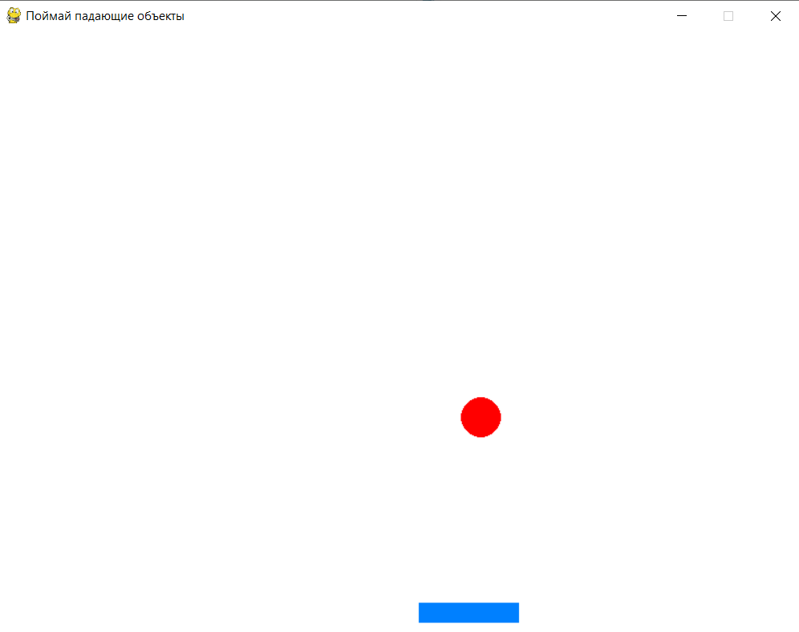
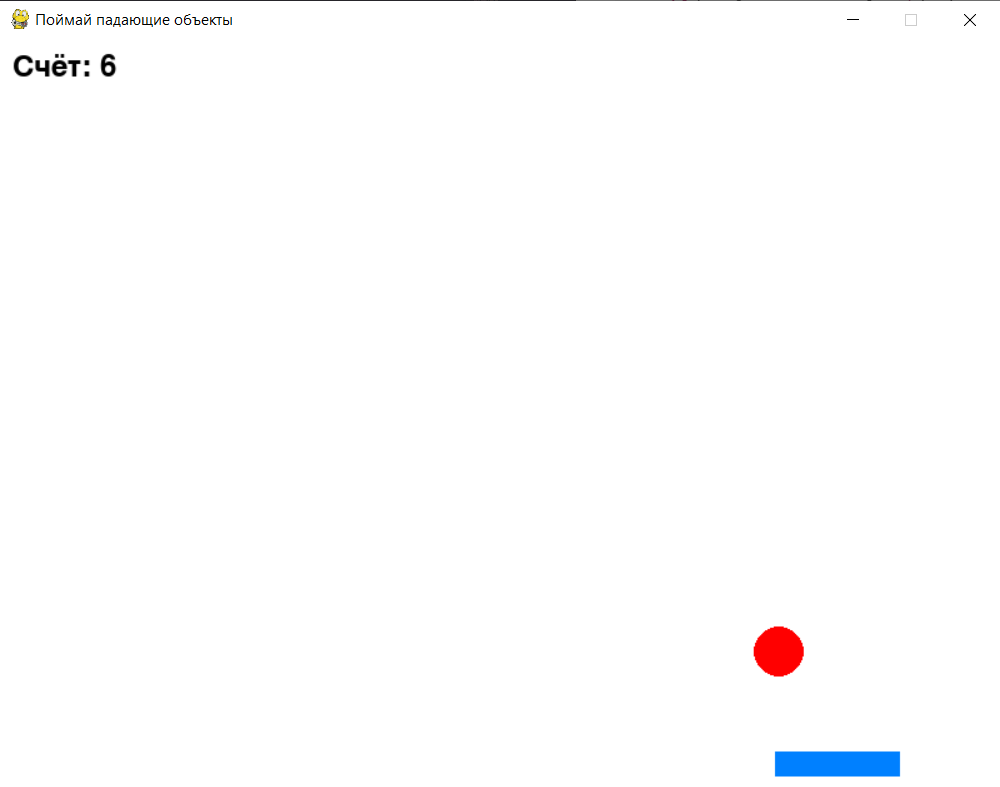

# Коллизии и столкновения — "Поймай падающие объекты"


## Основы коллизий

**Коллизия** — это момент столкновения между двумя объектами. В Pygame коллизии можно проверять с помощью метода `colliderect()` для прямоугольников (`Rect`), что делает его удобным для игр. Мы будем использовать эту функцию, чтобы проверять, поймала ли корзина падающее яблоко.

## Создание окна и объектов корзины и яблок

Сначала создадим окно игры, корзину, которой можно управлять, и падающее яблоко.

<div>
    
</div>

1. **Корзина**: `pygame.draw.rect()` рисует прямоугольник для корзины, который можно перемещать влево и вправо с помощью клавиш.

2. **Яблоко**: `pygame.draw.circle()` рисует яблоко, которое падает сверху вниз. Если яблоко достигает нижней границы экрана, оно возвращается наверх.

```python
import pygame
import random

# Инициализация Pygame
pygame.init()

# Задаём размеры окна
WIDTH, HEIGHT = 800, 600
screen = pygame.display.set_mode((WIDTH, HEIGHT))
pygame.display.set_caption("Поймай падающие объекты")
FPS = pygame.time.Clock()

# Цвета
background_color = (255, 255, 255)  # Белый фон
basket_color = (0, 128, 255)        # Синий цвет для корзины
apple_color = (255, 0, 0)           # Красный цвет для яблока

# Параметры корзины
basket_width = 100
basket_height = 20
basket_x = WIDTH // 2 - basket_width // 2  # Начальная позиция корзины по центру
basket_y = HEIGHT - basket_height - 10
basket_speed = 10  # Скорость движения корзины

# Параметры яблока
apple_radius = 20
apple_x = random.randint(apple_radius, WIDTH - apple_radius)  # Случайная начальная позиция яблока
apple_y = 0  # Яблоко начинает падение с верхней части экрана
apple_speed = 5  # Скорость падения яблока

# Основной игровой цикл
running = True
while running:
    for event in pygame.event.get():  # Обрабатываем события
        if event.type == pygame.QUIT:  # Проверка на закрытие окна
            running = False

    # Получаем состояние всех клавиш
    keys = pygame.key.get_pressed()

    # Управление корзиной
    if keys[pygame.K_LEFT] and basket_x > 0:
        basket_x -= basket_speed
    if keys[pygame.K_RIGHT] and basket_x < WIDTH - basket_width:
        basket_x += basket_speed

    # Обновление позиции яблока (падение вниз)
    apple_y += apple_speed

    # Если яблоко упало ниже экрана, оно возвращается наверх
    if apple_y > HEIGHT:
        apple_x = random.randint(apple_radius, WIDTH - apple_radius)
        apple_y = 0

    # Очистка экрана
    screen.fill(background_color)

    # Рисуем корзину
    pygame.draw.rect(screen, basket_color, (basket_x, basket_y, basket_width, basket_height))

    # Рисуем яблоко
    pygame.draw.circle(screen, apple_color, (apple_x, apple_y), apple_radius)

    pygame.display.flip()  # Обновляем экран
    FPS.tick(60)

# Завершаем работу Pygame
pygame.quit()
```

## Проверка коллизий между корзиной и яблоком

Теперь добавим проверку коллизий, чтобы определить, поймала ли корзина падающее яблоко. Если корзина поймала яблоко, увеличим счётчик очков, и яблоко начнёт падать с новой случайной позиции.

<div>
    
</div>

1. **Проверка коллизии**:

    - `basket_rect` и `apple_rect` создают прямоугольные области для корзины и яблока.

    - `colliderect()` проверяет пересечение этих прямоугольников. Если корзина пересекает яблоко, значит, яблоко поймано.

2. **Обновление счёта**:

    - Если коллизия произошла, `score += 1` увеличивает счётчик на единицу.

    - После этого яблоко перемещается в случайную позицию наверху экрана для повторного падения.

3. **Отображение счёта**:

    - `score_text` — создаёт текст, отображающий текущий счёт, и `screen.blit(score_text, (10, 10))` выводит его на экран.

```python
import pygame
import random

pygame.init()

WIDTH, HEIGHT = 800, 600
screen = pygame.display.set_mode((WIDTH, HEIGHT))
pygame.display.set_caption("Поймай падающие объекты")
FPS = pygame.time.Clock()

background_color = (255, 255, 255)
basket_color = (0, 128, 255)
apple_color = (255, 0, 0)

basket_width = 100
basket_height = 20
basket_x = WIDTH // 2 - basket_width // 2
basket_y = HEIGHT - basket_height - 10
basket_speed = 10

apple_radius = 20
apple_x = random.randint(apple_radius, WIDTH - apple_radius)
apple_y = 0
apple_speed = 5

# Счётчик очков
score = 0
font = pygame.font.Font(None, 36)  # Шрифт для отображения счёта

running = True
while running:
    for event in pygame.event.get():
        if event.type == pygame.QUIT:
            running = False

    keys = pygame.key.get_pressed()

    if keys[pygame.K_LEFT] and basket_x > 0:
        basket_x -= basket_speed
    if keys[pygame.K_RIGHT] and basket_x < WIDTH - basket_width:
        basket_x += basket_speed

    apple_y += apple_speed

    if apple_y > HEIGHT:
        apple_x = random.randint(apple_radius, WIDTH - apple_radius)
        apple_y = 0

    # Проверка коллизии корзины и яблока
    basket_rect = pygame.Rect(basket_x, basket_y, basket_width, basket_height)
    apple_rect = pygame.Rect(apple_x - apple_radius, apple_y - apple_radius, apple_radius * 2, apple_radius * 2)
    
    if basket_rect.colliderect(apple_rect):  # Проверка столкновения
        score += 1  # Увеличиваем счёт за пойманное яблоко
        print("Счёт:", score)
        # Перемещаем яблоко в новую случайную позицию наверху
        apple_x = random.randint(apple_radius, WIDTH - apple_radius)
        apple_y = 0

    # Очистка экрана
    screen.fill(background_color)

    # Рисуем корзину
    pygame.draw.rect(screen, basket_color, (basket_x, basket_y, basket_width, basket_height))

    # Рисуем яблоко
    pygame.draw.circle(screen, apple_color, (apple_x, apple_y), apple_radius)

    # Отображаем счёт на экране
    score_text = font.render("Счёт: " + str(score), True, (0, 0, 0))
    screen.blit(score_text, (10, 10))

    pygame.display.flip()
    FPS.tick(60)

pygame.quit()
```

