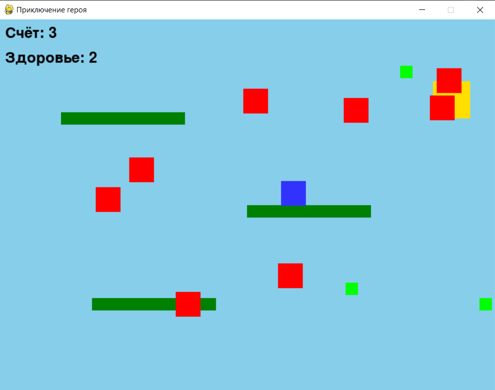

# 2D-игра: Приключение героя

<div>
    
</div>

## Настройка окна и основных переменных

В этой части кода мы инициализируем Pygame, настраиваем окно, основные цвета и параметры игры, включая параметры героя, врагов, предметов, платформ и финишной зоны.

- Здесь мы создаем экран размером `800x600` и устанавливаем название окна.

- Настраиваем параметры героя, такие как его начальная позиция, скорость, сила прыжка, гравитация и цвет.

- Определяем параметры врагов и предметов, а также цвет и размеры платформ.

- `platforms` — список, содержащий платформы, на которые герой может прыгать, а `finish_rect` определяет область финиша.

```python
import pygame
import random

pygame.init()

# Настройка экрана
WIDTH, HEIGHT = 800, 600
screen = pygame.display.set_mode((WIDTH, HEIGHT))
pygame.display.set_caption("Приключение героя")
FPS = pygame.time.Clock()

# Цвета и основные параметры
background_color = (135, 206, 235)
hero_color = (50, 50, 255)
platform_color = (0, 128, 0)
finish_color = (255, 223, 0)
hero_width, hero_height = 40, 40
hero_x, hero_y = WIDTH // 2, HEIGHT - hero_height
hero_speed = 5
jump_strength = -13
gravity = 0.5
hero_velocity_y = 0
is_jumping = False
enemy_color = (255, 0, 0)
item_color = (0, 255, 0)
enemy_width, enemy_height = 40, 40
item_width, item_height = 20, 20
score = 0
health = 3
font = pygame.font.SysFont(None, 36)

# Платформы и финишная зона
platforms = [
    pygame.Rect(150, 450, 200, 20),
    pygame.Rect(400, 300, 200, 20),
    pygame.Rect(100, 150, 200, 20)
]
finish_rect = pygame.Rect(700, 100, 60, 60)
```

## Функции для отображения текста и создания объектов

Создаем функции для вывода текста на экран и генерации новых врагов и предметов.

- `draw_text` отображает текст (например, счёт и здоровье) на экране по указанным координатам.

- `create_enemy` и `create_item` создают врагов и предметы на экране в случайных позициях, что добавляет элемент случайности.

```python
def draw_text(text, font, color, x, y):
    screen_text = font.render(text, True, color)
    screen.blit(screen_text, (x, y))

def create_enemy():
    x = random.randint(0, WIDTH - enemy_width)
    y = random.randint(50, HEIGHT - 150)
    return pygame.Rect(x, y, enemy_width, enemy_height)

def create_item():
    x = random.randint(0, WIDTH - item_width)
    y = random.randint(50, HEIGHT - 150)
    return pygame.Rect(x, y, item_width, item_height)
```

## Основной игровой цикл

Это основной игровой цикл, в котором обрабатываются события, обновляются позиции объектов и перерисовывается экран.

```python
running = True
while running:
    # Обработка событий
    for event in pygame.event.get():
        if event.type == pygame.QUIT:
            running = False
        elif event.type == pygame.KEYDOWN:
            if event.key == pygame.K_SPACE and not is_jumping:
                hero_velocity_y = jump_strength
                is_jumping = True
                jump_sound.play()

    # Управление персонажем
    keys = pygame.key.get_pressed()
    if keys[pygame.K_LEFT] and hero_x > 0:
        hero_x -= hero_speed
    if keys[pygame.K_RIGHT] and hero_x < WIDTH - hero_width:
        hero_x += hero_speed

    # Применение гравитации и ограничение прыжка
    hero_velocity_y += gravity
    hero_y += int(hero_velocity_y)

    if hero_y + hero_height >= HEIGHT:
        hero_y = HEIGHT - hero_height
        hero_velocity_y = 0
        is_jumping = False
```

## Регулярное появление врагов и предметов

В этой части добавлены таймеры для создания новых врагов и предметов через определенные промежутки времени.

```python
enemy_timer = 0
item_timer = 0

while running:
    enemy_timer += 1
    item_timer += 1

    if enemy_timer > 120:
        enemies.append(create_enemy())
        enemy_timer = 0

    if item_timer > 180:
        items.append(create_item())
        item_timer = 0
```

## Добавление звуков и музыки

Добавление звуков для прыжков, столкновений и фона музыки для создания атмосферы.

```python
# Загрузка звуков
jump_sound = pygame.mixer.Sound("turn_sound.mp3")
collision_sound = pygame.mixer.Sound("collision_sound.mp3")
pygame.mixer.music.load("background_music.mp3")
pygame.mixer.music.play(-1)
```

## Проверки и отрисовка

```python
    # Проверка столкновений с платформами
    hero_rect = pygame.Rect(hero_x, hero_y, hero_width, hero_height)
    for platform in platforms:
        if hero_rect.colliderect(platform) and hero_velocity_y > 0:
            hero_y = platform.top - hero_height
            hero_velocity_y = 0
            is_jumping = False

    # Проверка достижения финиша
    if hero_rect.colliderect(finish_rect):
        print("Поздравляем! Вы достигли финиша!")
        running = False
```

## Полный итоговый код

```python
import pygame
import random

pygame.init()

WIDTH, HEIGHT = 800, 600
screen = pygame.display.set_mode((WIDTH, HEIGHT))
pygame.display.set_caption("Приключение героя")
FPS = pygame.time.Clock()

# Цвета и параметры
background_color = (135, 206, 235)
hero_color = (50, 50, 255)
platform_color = (0, 128, 0)
finish_color = (255, 223, 0)  # Цвет финиша
hero_width, hero_height = 40, 40
hero_x, hero_y = WIDTH // 2, HEIGHT - hero_height
hero_speed = 5
jump_strength = -13
gravity = 0.5
hero_velocity_y = 0
is_jumping = False
enemy_color = (255, 0, 0)
item_color = (0, 255, 0)
enemy_width, enemy_height = 40, 40
item_width, item_height = 20, 20
score = 0
health = 3
font = pygame.font.SysFont(None, 36)

# Загрузка звуков
jump_sound = pygame.mixer.Sound("turn_sound.mp3")
collision_sound = pygame.mixer.Sound("collision_sound.mp3")
pygame.mixer.music.load("background_music.mp3")
pygame.mixer.music.play(-1)

# Платформы
platforms = [
    pygame.Rect(150, 450, 200, 20),
    pygame.Rect(400, 300, 200, 20),
    pygame.Rect(100, 150, 200, 20)
]

# Параметры финиша
finish_rect = pygame.Rect(700, 100, 60, 60)

# Враги и предметы
enemies = []
items = []
enemy_timer = 0
item_timer = 0

def draw_text(text, font, color, x, y):
    screen_text = font.render(text, True, color)
    screen.blit(screen_text, (x, y))

def create_enemy():
    x = random.randint(0, WIDTH - enemy_width)
    y = random.randint(50, HEIGHT - 150)
    return pygame.Rect(x, y, enemy_width, enemy_height)

def create_item():
    x = random.randint(0, WIDTH - item_width)
    y = random.randint(50, HEIGHT - 150)
    return pygame.Rect(x, y, item_width, item_height)

running = True
while running:
    enemy_timer += 1
    item_timer += 1

    # Создание врагов и предметов
    if enemy_timer > 120:
        enemies.append(create_enemy())
        enemy_timer = 0

    if item_timer > 180:
        items.append(create_item())
        item_timer = 0

    # Обработка событий
    for event in pygame.event.get():
        if event.type == pygame.QUIT:
            running = False
        elif event.type == pygame.KEYDOWN:
            if event.key == pygame.K_SPACE and not is_jumping:
                hero_velocity_y = jump_strength
                is_jumping = True
                jump_sound.play()

    # Управление персонажем
    keys = pygame.key.get_pressed()
    if keys[pygame.K_LEFT] and hero_x > 0:
        hero_x -= hero_speed
    if keys[pygame.K_RIGHT] and hero_x < WIDTH - hero_width:
        hero_x += hero_speed

    # Применение гравитации
    hero_velocity_y += gravity
    hero_y += int(hero_velocity_y)

    # Ограничение прыжка
    if hero_y + hero_height >= HEIGHT:
        hero_y = HEIGHT - hero_height
        hero_velocity_y = 0
        is_jumping = False

    # Проверка столкновений с платформами
    hero_rect = pygame.Rect(hero_x, hero_y, hero_width, hero_height)
    for platform in platforms:
        if hero_rect.colliderect(platform) and hero_velocity_y > 0:
            hero_y = platform.top - hero_height  # Ставим героя на платформу
            hero_velocity_y = 0
            is_jumping = False  # Сбрасываем флаг прыжка, позволяя прыгать снова

    # Проверка столкновений с врагами и предметами
    for enemy in enemies[:]:
        if hero_rect.colliderect(enemy):
            collision_sound.play()
            health -= 1
            enemies.remove(enemy)
            if health == 0:
                running = False  # Заканчиваем игру, если здоровье на нуле

    for item in items[:]:
        if hero_rect.colliderect(item):
            score += 1
            items.remove(item)

    # Проверка достижения финиша
    if hero_rect.colliderect(finish_rect):
        print("Поздравляем! Вы достигли финиша!")
        running = False  # Заканчиваем игру при достижении финиша

    # Ограничение по краям экрана
    if hero_x < 0:
        hero_x = 0
    elif hero_x + hero_width > WIDTH:
        hero_x = WIDTH - hero_width

    # Очистка экрана и обновление
    screen.fill(background_color)

    # Отображение платформ
    for platform in platforms:
        pygame.draw.rect(screen, platform_color, platform)

    # Отображение финиша
    pygame.draw.rect(screen, finish_color, finish_rect)

    # Отображение персонажа, врагов и предметов
    pygame.draw.rect(screen, hero_color, hero_rect)
    for enemy in enemies:
        pygame.draw.rect(screen, enemy_color, enemy)
    for item in items:
        pygame.draw.rect(screen, item_color, item)

    # Отображение счёта и здоровья
    draw_text(f"Счёт: {score}", font, (0, 0, 0), 10, 10)
    draw_text(f"Здоровье: {health}", font, (0, 0, 0), 10, 50)

    pygame.display.flip()
    FPS.tick(60)

pygame.quit()
```
